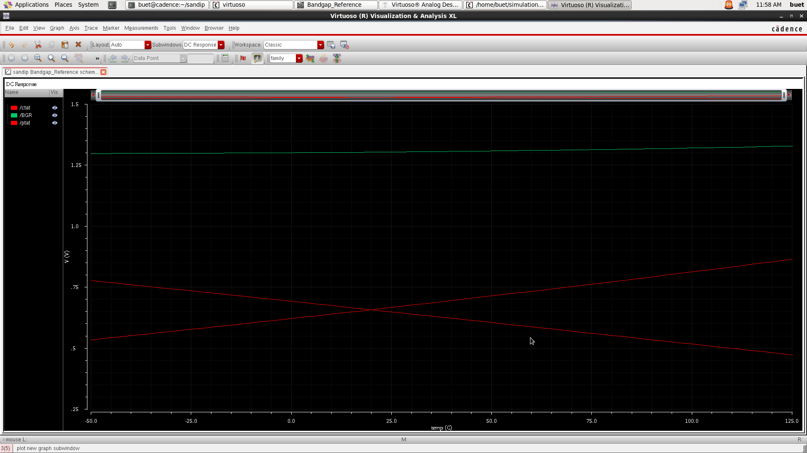

# 🧩 Bandgap Reference Circuit (Cadence Virtuoso)

This project implements a **CMOS Bandgap Reference (BGR)** circuit designed and simulated using **Cadence Virtuoso** with the **gpdk090** process.  
The design provides a **temperature-independent reference voltage (~1.25 V)** by combining complementary-to-absolute-temperature (CTAT) and proportional-to-absolute-temperature (PTAT) voltage components.

---

## 📘 Overview

A **bandgap reference** generates a stable DC voltage that is independent of:
- Power supply variations  
- Temperature changes  
- Process variations (to some extent)

The principle is to sum:
- A **CTAT** voltage (base–emitter voltage of a BJT)  
- A **PTAT** voltage (generated using a differential pair and resistor network)

Their opposite temperature coefficients cancel out at a specific ratio, resulting in a nearly constant reference voltage of around **1.2 – 1.3 V**.

---

## ⚙️ Design Specifications

| Parameter | Description | Typical Value |
|------------|--------------|----------------|
| Technology | gpdk090 | 90 nm CMOS |
| Supply Voltage (VDD) | 3.3 V |  |
| Reference Voltage (Vref) | ~1.25 V |  |
| Temperature Range | −50 °C – 125 °C |  |
| PSRR | High |  |
| Power Consumption | Low |  |

---

## 🧠 Circuit Description

### 🟢 Core Components
- **BJT Pair (Q1, Q2, Q7):** Generates ΔVbe (PTAT component)  
- **Resistors (R0, R1):** Define scaling ratio between PTAT and CTAT voltages  
- **MOSFET Current Mirror (PM1–PM3, NM1–NM3):** Biasing and mirroring circuits  
- **Output Node (BGR):** Summed and amplified PTAT + CTAT to form Vref  

### 🧩 Key Nodes
- **ctat:** Collector node showing CTAT voltage (decreases with T)  
- **ptat:** Resistor node generating PTAT voltage (increases with T)  
- **bgr:** Final summed reference voltage  

---

## 📈 Simulation Results

### ✅ DC Sweep – Temperature Dependence

**Observations:**
- The **CTAT voltage** (`/ctat`) decreases with temperature.  
- The **PTAT voltage** (`/ptat`) increases with temperature.  
- Their sum (**/BGR**) remains **nearly constant (~1.25 V)** across −50 °C to +125 °C.

This confirms the **temperature independence** of the reference voltage.

---

## 🧰 Tools & Environment

| Tool | Version | Purpose |
|------|----------|----------|
| Cadence Virtuoso | 6.1.x / 7.x | Schematic & Simulation |
| gpdk090 | 90 nm PDK | Device models |
| Virtuoso Visualization & Analysis XL | — | Waveform plotting |

---

---

## 🧪 How to Simulate

1. Open **Cadence Virtuoso** and load the design library.  
2. Open the **Bandgap_Reference schematic**.  
3. Run **DC Analysis**:
   - Sweep **temperature** from −50 °C to +125 °C.  
   - Plot `/ctat`, `/ptat`, and `/bgr`.  
4. Verify that `/bgr` remains nearly constant with temperature.

